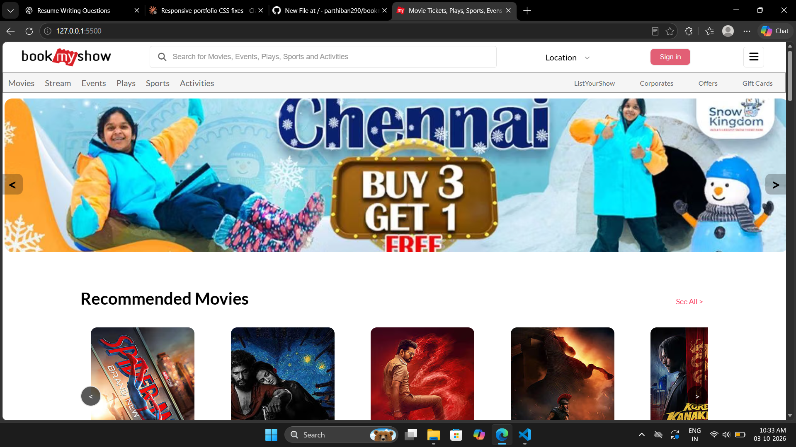
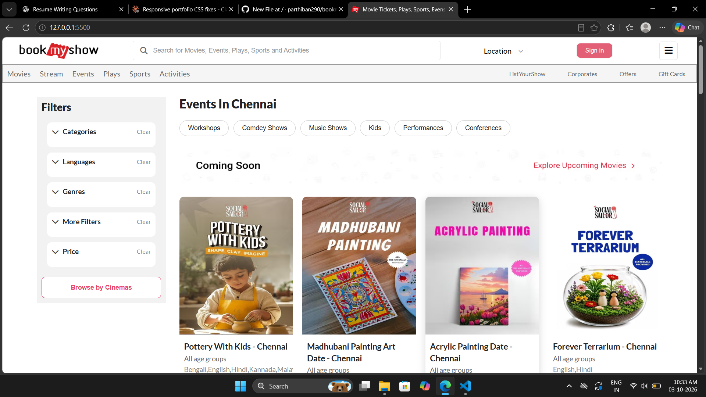
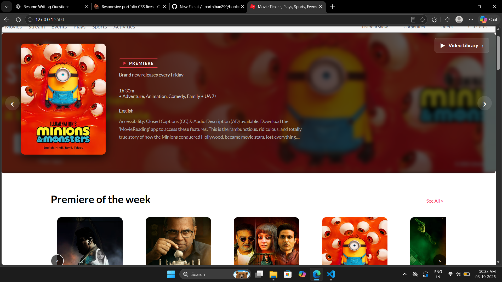
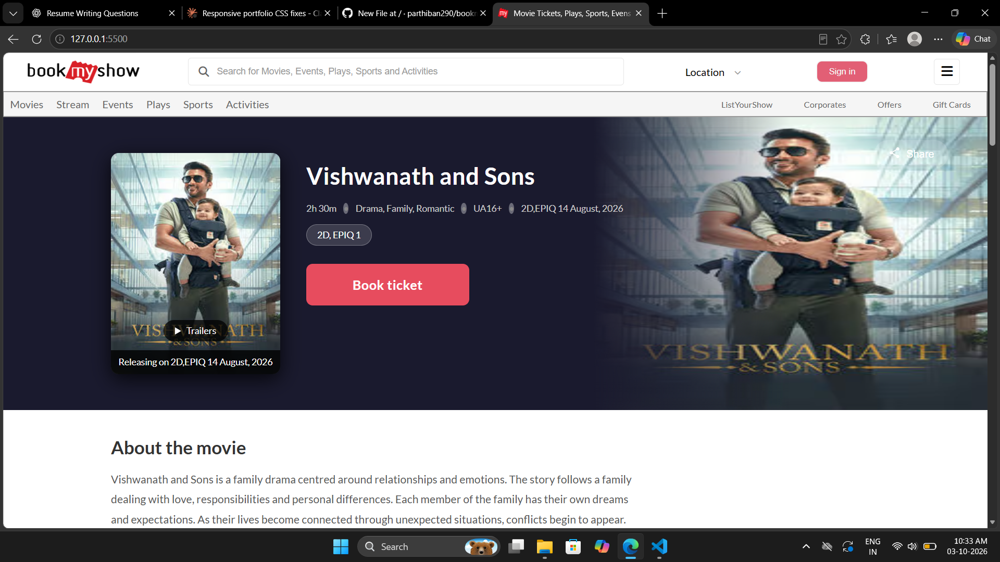
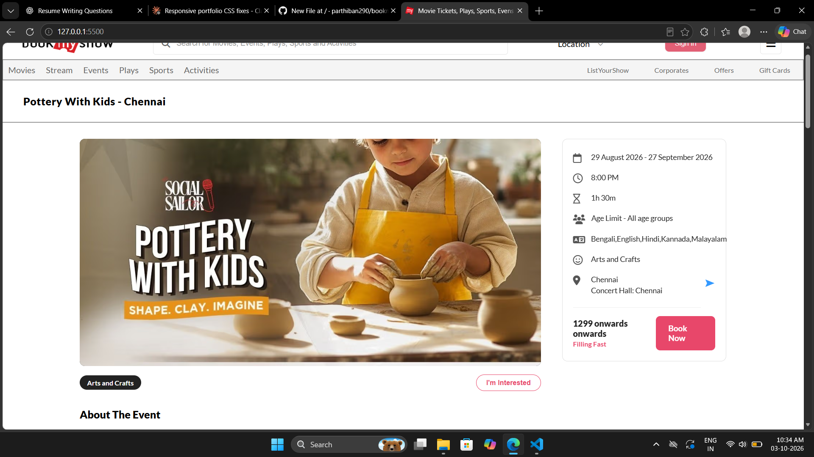

.
🎬 BookMyShow Clone — Full-Stack Booking Platform
A full-stack movie and event booking web application inspired by BookMyShow. The project was developed using Python, Django, Django REST Framework, PostgreSQL, JavaScript, HTML5, and CSS3.
The application provides dynamic movie, event, theater, showtime, sports, activities, and streaming content through REST APIs. The frontend uses JavaScript and the Fetch API to retrieve data from the Django backend and dynamically display the content.

🚀 Features

🎥 Movies
- Display movie listings dynamically.
- View movie details.
- Filter movies based on available categories and information.
- Fetch movie data through REST APIs.
- Display movie posters, descriptions, language, genre, certificate, and other details.

🎭 Events & Activities
- Browse different types of events.
- Event filtering and dynamic content loading.
- Support for categories such as:
  - Events
  - Plays
  - Sports
  - Activities
  - Streaming content

🎬 Theater & Showtime
- Display available theaters.
- View available showtimes.
- Select a theater and corresponding showtime.
- Dynamically load theater and showtime information from the backend API.

💺 Seat Selection
- Interactive seat selection interface.
- Select available seats for booking.
- Track selected seats using JavaScript.
- Calculate the booking amount based on selected tickets/seats.

🎟️ Ticket Booking
- Select ticket quantity.
- Dynamically calculate the ticket price.
- Display selected booking information.
- Event ticket selection flow.
- Payment-option interface.

🔄 Dynamic API Integration
The frontend communicates with the Django backend using the Fetch API.
Example:
fetch("http://127.0.0.1:8000/api/homepage/")
    .then(response => response.json())
    .then(data => {
        // Process and display API data
    });

This allows the frontend to retrieve backend data without manually adding movie and event information to every page.

🛠️ Technologies Used
Frontend
- HTML5
- CSS3
- JavaScript
- Fetch API
Backend
- Python
- Django
- Django REST Framework
Database
- PostgreSQL
Development Tools
- Git
- GitHub
- VS Code
- Postman

#🏗️ Project Architecture
```
The project follows a basic frontend → REST API → Django backend → PostgreSQL database architecture.
User
  │
  ▼
Frontend
HTML + CSS + JavaScript
  │
  │ Fetch API
  ▼
Django REST Framework
  │
  ▼
Django Backend
  │
  │ Django ORM
  ▼
PostgreSQL Database
```
🔌 REST API Endpoints
The project uses Django REST Framework to provide data to the frontend.
Some of the APIs implemented in the project include:
API Endpoint	Purpose
/api/homepage/	Homepage content
/api/Moviefilter/	Movie filtering
/api/StreamingMovies/	Streaming movies
/api/EventFilter/	Event filtering
/api/PlaysFilter/	Plays filtering
/api/SportFilter/	Sports filtering
/api/ActivitiesFilter/	Activities filtering
/api/TheaterList/	Theater information
/api/ShowTime/	Showtime information


These endpoints are designed to provide structured data from Django to the JavaScript frontend.

🗄️ Backend & Database
The backend is developed using Django and Django REST Framework.
Django models are used to manage application data, while Django ORM provides communication between the application and PostgreSQL database.
The project uses:
- Django Models
- Django ORM
- Django REST Framework
- Serializers
- API Views
- PostgreSQL
- Database migrations
The database stores information related to movies, events, theaters, showtimes, sports, activities, and other application content.

🌐 Frontend Implementation
The frontend is built using HTML5, CSS3, and JavaScript.
JavaScript is used for:
- Fetching API data
- Dynamic content rendering
- Movie filtering
- Event filtering
- Theater selection
- Showtime selection
- Seat selection
- Ticket quantity
- Price calculation
- Page navigation
- User interactions
The Fetch API is used to communicate with the Django REST APIs.

## 📁 Project Structure

A simplified structure of the project:

```text
BookMyShow-Clone/
│
├── api/
│   └── ticketbooking/
│
├── image/
│
├── picture/
│
├── index.html
├── javascripts.js
├── style.css
│
└── README.md
```

⚙️ Installation & Setup
1. Clone the Repository
git clone <your-github-repository-url>

cd BookMyShow-Clone

2. Create a Virtual Environment
python -m venv venv

Windows
venv\Scripts\activate

3. Install Dependencies
pip install -r requirements.txt

4. Configure PostgreSQL
Create a PostgreSQL database and configure the database settings in Django.
Important: For a public GitHub repository, database credentials and Django secret keys should be stored using environment variables, not directly inside the source code.
5. Run Migrations
python manage.py makemigrations

python manage.py migrate

6. Start the Django Server
python manage.py runserver

The backend will normally be available at:
http://127.0.0.1:8000/

🔗 API Testing
The REST APIs can be tested using Postman.
For example:
GET http://127.0.0.1:8000/api/homepage/

Postman can be used to verify:
- API response
- HTTP status
- JSON data
- Endpoint functionality
- Backend data
📸 Project Screenshots
Add screenshots of your application here.
For example:
## 📸 Screenshots

### Homepage


### Movie Filter


### Streaming


### Movie Description


### Event Description


🎯 Project Objectives
The main objectives of this project were:
- To understand full-stack web application development.
- To learn how frontend applications communicate with backend APIs.
- To build REST APIs using Django REST Framework.
- To work with PostgreSQL and Django ORM.
- To implement dynamic frontend functionality using JavaScript.
- To understand the basic workflow of a movie and event booking platform.

📚 Key Learning
Through this project, I gained practical experience in:
- Python and Django development
- Django REST Framework
- REST API development and consumption
- PostgreSQL database integration
- Django ORM
- JavaScript Fetch API
- Dynamic DOM rendering
- Frontend and backend integration
- Git and GitHub
- API testing using Postman
- Building a complete full-stack web application

🔮 Future Improvements
Possible future improvements include:
- User registration and login improvements
- Real-time seat availability
- Booking history
- Email/SMS booking confirmation
- Integration with a real payment gateway
- Deployment using production-ready infrastructure
- Improved security and environment-based configuration
- Better mobile responsiveness

👨‍💻 Developer
Parthiban D.
B.Tech Computer Science and Engineering — 2026
Chennai, Tamil Nadu
Linkedin[https://www.linkedin.com/in/parthiban-d-/?isSelfProfile=true]
Technologies
Python Django Django REST Framework PostgreSQL JavaScript HTML5 CSS3 Git GitHub Postman
